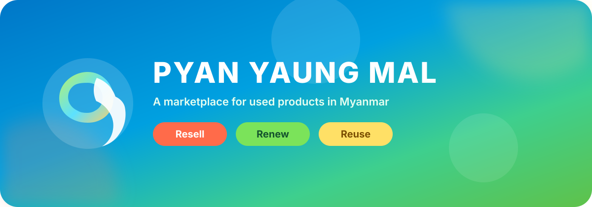

  

  
  
  
  

<h1 align="center">PyanYaungMal</h1>

<strong>Resell · Renew · Reuse</strong> — buy and sell used products in Myanmar.

<table>
  <tr>
    <td align="center" width="33%">
      <h3>🧡 Resell</h3>
      List what you no longer need with photos, a description, and a price.
    </td>
    <td align="center" width="33%">
      <h3>💚 Renew</h3>
      Give items a second life instead of buying everything new.
    </td>
    <td align="center" width="33%">
      <h3>💛 Reuse</h3>
      Pay with KBZ Pay or Wave Pay QR — no in-app purchase required.
    </td>
  </tr>
</table>

> [!TIP]
> **Create an account first**, then start buying or selling.

## How it works

1. **Sign up** and sign in. You can add extra accounts later and switch between them.
2. **Sellers** upload a **KBZ Pay** or **Wave Pay** QR code, one or more product photos, a description, and a price.
3. When someone **buys**, the seller is notified in chat.
4. After payment, the seller marks the listing **sold out**, and it leaves Explore.

> [!NOTE]
> In-app purchases are not available in some parts of Myanmar. Payment happens with a QR code and a **screenshot in chat**.
